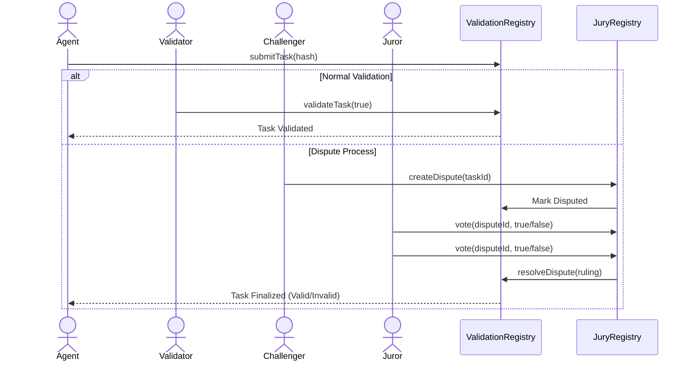

# ERC-8004 POC: Ethereum AI Agent Registration

This project is a Proof of Concept (POC) for **ERC-8004**, a standard for registering AI Agents on the Ethereum blockchain. It demonstrates the core concepts of Agent Identity, Incentivized Validation, Reputation, and Indexing.

## Features

*   **Agent Identity Registry**: ERC-721 contract to register AI Agents with unique IDs and metadata.
*   **Agent Validation Registry**: System for agents to submit tasks with a **validation fee**, paid to validators upon verification.
*   **Agent Reputation Registry**: System to record and retrieve reputation scores and reviews.
*   **Agent Service Registry**: Registry for agents to list their available services/resources.
*   **Indexer (Ponder)**: A local-first indexer that aggregates on-chain events into a queryable GraphQL API.
*   **Agent Explorer (Frontend)**: A Next.js web interface to discover agents and view their reputation/history.

## Prerequisites

*   **Node.js**: v18 or higher (Recommended: v20 LTS or v22 LTS).
    *   *Note*: Avoid Node.js v25+ due to potential Hardhat compatibility issues.
*   **npm**: Installed with Node.js.
*   **Git**: For cloning the repository.

## 🚀 Comprehensive Guide

Follow these steps to run the entire system, including the blockchain, indexer, and frontend.

### 1. Setup Environment
Install dependencies for all components.
```bash
# Root dependencies (Hardhat)
npm install

# Indexer dependencies
cd ponder && npm install && cd ..

# Frontend dependencies
cd frontend && npm install && cd ..
```

### 2. Start Local Blockchain
Open **Terminal 1**. Start the Hardhat node to mimic Ethereum locally.
```bash
npx hardhat node
```
*Keep this terminal running.*

### 3. Start the Indexer
Open **Terminal 2**. Start Ponder to index events from the local blockchain.
```bash
cd ponder
npm run dev
```
*Keep this terminal running.*

### 4. Start the Frontend Explorer
Open **Terminal 3**. Start the Next.js frontend to view agents.
```bash
cd frontend
npm run dev
```
*Keep this terminal running.* Open [http://localhost:3000](http://localhost:3000) in your browser.

---

### 🧪 Use Case 1: Basic Agent Workflow
Simulate an agent registering, performing a task, and getting validated.

Open **Terminal 4** and run:
```bash
npx hardhat run scripts/demo.js --network localhost
```
**What happens:**
1.  Contracts are deployed.
2.  Agent registers (ID: 1).
3.  Agent registers a service.
4.  Agent submits a task.
5.  Validator verifies the task (Optimistic Validation).
6.  **Check the Frontend**: Refresh [localhost:3000](http://localhost:3000) to see the new agent and task.

### ⚖️ Use Case 2: Dispute Resolution (Jury)
Simulate a malicious agent submitting an invalid task, which is challenged and slashed by a jury.

In **Terminal 4**, run:
```bash
npx hardhat run scripts/demo_jury.js --network localhost
```
**What happens:**
1.  Agent submits a task.
2.  Challenger raises a dispute (staking a fee).
3.  3 Jurors vote (2 vote "Invalid", 1 votes "Valid").
4.  **Ruling Executed**: The agent is slashed.
5.  **Incentives**: The Challenger and winning Jurors are rewarded with the slashed funds.
6.  **Check the Frontend**: Go to the agent's detail page to see the disputed task marked with ⚠️.

### 4. Decentralized Jury (Dispute Resolution)
A mechanism for trustless dispute resolution.
- **Jury Registry**: Allows users to stake ETH to become jurors.
- **Dispute Mechanism**: If a task is challenged, jurors vote on its validity.
- **Economic Security**: Jurors are incentivized to vote honestly (in a full implementation), and the loser of the dispute pays the fees.

## 🔄 The ERC-8004 Workflow

### Visual Workflow


### Step-by-Step
1.  **Registration**: Agent registers identity and services.
2.  **Service Discovery**: Users find agents via the Indexer.
3.  **Task Execution**: Agent performs work and submits a hash of the result to `AgentValidationRegistry`.
4.  **Validation**:
    *   **Optimistic**: A validator confirms the result.
    *   **Dispute**: If the result is suspicious, a Challenger raises a dispute in `AgentJuryRegistry`.
5.  **Resolution**: Jurors vote on the dispute. The majority ruling is executed on-chain.

## 💰 Incentive Mechanism

### 1. Registration
Agents mint an NFT ID via `AgentIdentityRegistry`. This establishes their on-chain identity.

### 2. Staking
*   **Agents**: Must stake ETH to register. This stake is slashed if they act maliciously.
*   **Jurors**: Must stake ETH to participate in the court. This ensures they have "skin in the game".

### 3. Game Theory (Schelling Point)
The system uses a **Schelling Point** mechanism to incentivize honest voting without a central authority.
*   **Concept**: Jurors are rewarded for voting with the majority. Since the "truth" is the only common focal point that everyone expects others to vote for, honest voting becomes the dominant strategy.
*   **Loser Pays**:
    *   **If Agent Wins (Valid)**: The Challenger loses their dispute fee. This fee is distributed to the jurors who voted "Valid".
    *   **If Agent Loses (Invalid)**: The Agent's task fee (and potentially stake) is slashed. The Challenger gets their fee back + a reward. The remaining slashed funds are distributed to jurors who voted "Invalid".
*   **Result**: Spam disputes are costly (Challenger pays), and malicious agents are punished (Agent pays). Honest behavior is profitable.

### 4. Task Submission (Commitment)
Agents perform work off-chain and submit a **hash** of the result to `AgentValidationRegistry` along with a fee.
*   `submitTask(agentId, taskHash) payable`

### 5. Validation
Validators verify the off-chain work against the committed hash. If correct, they validate it on-chain and claim the fee.
*   `validateTask(taskId, isValid)`

### 5. Reputation
Users leave reviews for agents in `AgentReputationRegistry`, building a trust score over time.

## Project Structure

*   `contracts/`: Solidity smart contracts.
*   `scripts/`: Deployment and demo scripts.
*   `ponder/`: The Ponder indexer project.
    *   `ponder.config.ts`: Network and contract configuration.
    *   `ponder.schema.ts`: Database schema definition.
    *   `src/index.ts`: Event indexing logic.
*   `hardhat.config.js`: Hardhat configuration.

## Troubleshooting

*   **Indexer not picking up events?**
    *   Ensure `ponder.config.ts` has the correct contract addresses. If you restarted the Hardhat node, addresses might have changed (though Hardhat is deterministic, so they usually stay the same if deployment order is constant).
    *   Ensure the Hardhat node is running (`npx hardhat node`).
*   **"Class extends value undefined" error?**
    *   This is a known issue with Node.js v25+. Please downgrade to Node.js v20 or v22.

## License

MIT
