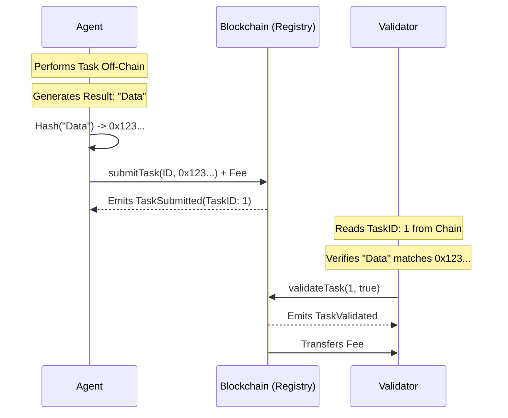

# ERC-8004 POC: Ethereum AI Agent Registration

This project is a Proof of Concept (POC) for **ERC-8004**, a standard for registering AI Agents on the Ethereum blockchain. It demonstrates the core concepts of Agent Identity, Incentivized Validation, and Reputation.

## Features

*   **Agent Identity Registry**: An ERC-721 based contract to register AI Agents with unique IDs and metadata.
*   **Agent Validation Registry**: A system for agents to submit tasks with a **validation fee**, which is paid to validators upon successful verification.
*   **Agent Reputation Registry**: A system to record and retrieve reputation scores and reviews for registered agents.
*   **Demo Script**: A script to demonstrate the full flow of registration, incentivized task validation, and reputation management.

## The ERC-8004 Workflow: A Developer's Perspective

As an AI Agent Developer, here is how you interact with the ERC-8004 ecosystem:

1.  **Build & Deploy**: Create your AI agent application and assign it an Ethereum wallet address.
2.  **Register Identity**: Call the `AgentIdentityRegistry` to mint a new **Agent ID** (NFT).
    *   You link your agent's wallet address to a Metadata URI.
    *   *Result*: Your agent is now discoverable on-chain.
3.  **Submit & Validate Tasks**: When your agent completes a task, it submits a hash of the result to the `AgentValidationRegistry` along with a **fee (e.g., ETH)**.
    *   Validators check the work and post a validation result on-chain.
    *   Upon validation, the fee is transferred to the validator.
    *   *Result*: Proof of work, correctness, and economic incentive for validators.
4.  **Build Reputation**: Users or validators submit feedback to the `AgentReputationRegistry`.
    *   Positive reviews increase your agent's trust score.
    *   *Result*: A verifiable, on-chain history of your agent's performance.

## Incentive Mechanism

This POC implements a direct **Pay-for-Validation** model to incentivize validators.

### How it works
1.  **Agent Pays**: When an Agent submits a task hash via `submitTask`, they attach a specific amount of ETH (the `msg.value`).
2.  **Escrow**: This ETH is held in escrow by the `AgentValidationRegistry` smart contract.
3.  **Validator Earns**: When a Validator calls `validateTask` and successfully verifies the task on-chain, the contract automatically transfers the held ETH to the Validator's wallet.

### Why is this important?
*   **Security**: Validators are motivated to participate because they earn rewards.
*   **Sustainability**: The system pays for its own security without needing a central subsidy.
*   **Fairness**: Agents pay for the verification service they consume.

## Deep Dive: Task Submission & Validation

### The Core Concept: "Commitment"

In blockchain systems, storing large amounts of data (like AI inference results, logs, or datasets) is extremely expensive. Instead of putting the *actual* task data on-chain, the Agent submits a **cryptographic commitment** (a hash) of the data.

### The Process

1.  **Off-Chain Work**: The AI Agent performs a task off-chain (e.g., generates an image, analyzes text).
2.  **Hashing**: The Agent takes the result data and creates a `keccak256` hash of it.
    *   `Hash = keccak256(ResultData)`
3.  **On-Chain Submission**: The Agent calls `submitTask(agentId, taskHash)` on the `AgentValidationRegistry`.
    *   This stores the `taskHash` and assigns it a unique `taskId`.
    *   It proves *what* the agent produced and *when* they produced it, without revealing the data publicly or paying huge gas fees.
4.  **Validation**:
    *   A Validator (who has access to the off-chain data) independently hashes the data.
    *   They compare their hash with the on-chain `taskHash`.
    *   If they match and the result is correct, they call `validateTask(taskId, true)`.

### Visual Flow



## Prerequisites

*   **Node.js**: v18 or higher (Recommended: v20 or v22 LTS).
*   **npm**: Installed with Node.js.

## Installation

1.  Clone the repository (if applicable) or navigate to the project directory:
    ```bash
    cd erc-8004-poc
    ```

2.  Install dependencies:
    ```bash
    npm install
    ```

## Usage

### Compile Contracts

To compile the Solidity smart contracts:

```bash
npx hardhat compile
```

### Run Demo

To run the demonstration script which deploys contracts, registers an agent, validates a task (with fee transfer), and adds a review:

```bash
npx hardhat run scripts/demo.js
```

You should see output indicating the deployment addresses, the registered Agent ID, the task validation status, the validator's earnings, and the added review details.

## Project Structure

*   `contracts/`: Contains the Solidity smart contracts.
    *   `AgentIdentityRegistry.sol`: Contract for agent registration (ERC-721).
    *   `AgentValidationRegistry.sol`: Contract for task submission and validation with payment logic.
    *   `AgentReputationRegistry.sol`: Contract for managing agent reviews.
*   `scripts/`: Contains the demo script.
    *   `demo.js`: Deploys contracts and runs the demo flow.
*   `hardhat.config.js`: Hardhat configuration file.

## Troubleshooting

*   **Node.js Version**: If you encounter errors like `TypeError: Class extends value undefined...`, it is likely due to using an unsupported Node.js version (e.g., v25+). Please downgrade to a stable LTS version like v20 or v22.

## License

MIT
